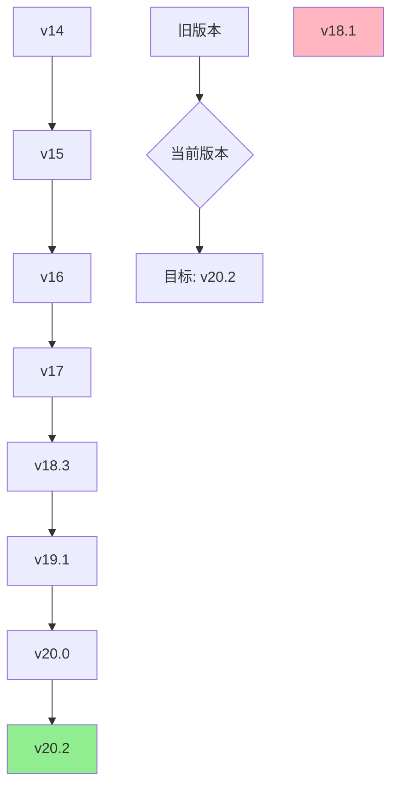

# 📊 版本追踪���录 (Version Tracking)

> AxiomOS 认知引擎系统完整版本历史和变更记录

## 📈 版本时间线

### 🟢 当前活跃版本

#### **AxiomOS v20.2** - 完整性协议增强版
- **发布日期**: 2025-01-05
- **文件**: `axiom-os-v20.2-001.md`
- **核心特性**:
  - 🆕 新增交付物完整性协议（Deliverable Integrity Protocol）
  - 🆕 增强的通用认知框架（Ultrathink）
  - 🆕 回归防止机制（L类质量门禁）
  - 🆕 严格的在位修改原则
  - 🆕 临时工件排除协议
  - ✅ 保留v20.0所有功能并优化
- **状态**: 🟢 生产就绪
- **支持期限**: 至少到 2027-01
- **升级路径**: v20.0 → v20.2 (直接升级)

#### **AxiomOS v20.0** - MCP工具生态集成版
- **发布日期**: 2025-09-30
- **文件**: `axiom-os-v20.md`
- **核心特性**:
  - 完整MCP工具生态集成
  - Artifact交付协议增强
  - 工具调用能力优化
  - 跨平台兼容性标准(K类)
  - 保留v19.1所有功能
- **状态**: 🟡 维护模式
- **支持期限**: 至少到 2026-09
- **升级路径**: v19.1 → v20.0 → v20.2

### 📦 归档版本

#### **AxiomOS v19.1** - 11大类质量门禁增强版
- **发布日期**: 2025-09-28
- **文件**: `axiom-os-v19.1.md` (中文) | `axiom-os-v19.1_en.md` (English)
- **核心特性**:
  - 11大类质量门禁(A-K)
  - SFAM全自动化模式
  - MTM微任务模式
  - 指令增强模式
  - 安全内核协议强化
- **状态**: 📦 已归档
- **支持期限**: 2026-09
- **历史意义**: 首个完整企业级质量保障体系

#### **AxiomOS v19.0** - 六大操作模式统一框架
- **发布日期**: 2025-09-27
- **文件**: `axiom-os-v19.0.md`
- **核心特性**:
  - 六大核心操作模式
  - Ultrathink协议
  - 上下文压缩协议
  - 全局上下文核心(.arc/)
- **状态**: 📦 已归档
- **支持期限**: 2025-12
- **历史意义**: 操作模式框架标准化

#### **AxiomOS v18.5** - 核心思维原则增强版
- **发布日期**: 2025-09-26
- **文件**: `axiom-os-v18.5.md`
- **核心特性**:
  - 新增核心思维原则 (Core Thinking Principles) - Section 3.1
  - 升级审计模式：从 Audit & Repair 到 Audit & Optimization
  - 新增指令增强模式 (Instruction Enhancement Mode)
  - 多维度分析框架：空间思维、立体思维、逆向思维
  - 上下文压缩协议国际化支持
  - Ultrathink协议结构化增强
  - 生产标准更严格（禁止任何非生产代码）
- **状态**: 📦 已归档
- **支持期限**: 2025-12
- **历史意义**: 认知框架结构化

#### **AxiomOS v18.3** - 安全内核增强版
- **发布日期**: 2025-09-26
- **文件**: `axiom-os-v18.3.md`
- **核心特性**:
  - 核心启动加载程序与安全内核 (Core Bootloader & Security Kernel)
  - 增强的指令边界定义和注入攻击检测
  - 不可变身份协议
  - 强制性自我诊断与交互协议升级
  - Ultrathink 深度战略分析协议
  - 完整保留v18.0的所有功能
  - 修复了v18.1中的身份声明错误
- **状态**: 📦 已归档
- **支持期限**: 2025-12
- **历史意义**: 安全内核标准化

#### **AxiomOS v18.1** - 过渡版本 ⚠️
- **发布日期**: 2025-09-26
- **问题**: 包含错误的身份声明（声称"由Google训练"）
- **状态**: ⚠️ 已废弃 - 请勿使用
- **说明**: 此版本包含严重错误，已被v18.3取代

## 🔄 版本演进路径

### 主要演进阶段

#### **阶段1: 协议标准化 (v14.0 - v17.2)**
- 建立基础协议框架
- 引入Dynamic Protocol概念
- 逐步完善指令结构

#### **阶段2: 认知框架化 (v18.0 - v19.1)**
- 统一核心指令框架
- 建立六大操作模式
- 完善质量门禁体系
- 强化安全内核

#### **阶段3: 生态集成 (v20.0 - v20.2)**
- 完整MCP工具生态集成
- 交付物协议增强
- 完整性协议标准化
- 回归防止机制

### 🎯 推荐升级路径

## 📋 版本选择矩阵

| 使用场景 | 推荐版本 | 理由 | 注意事项 |
|---------|---------|------|----------|
| **新项目启动** | v20.2 | 最完整功能，最佳质量保障 | 需要适应严格协议 |
| **企业级系统** | v20.2 | 完整质量门禁，回归防止 | 需要完整.arc/目录 |
| **MCP工具集成** | v20.2 | 完整MCP生态支持 | 需要配置环境变量 |
| **学习研究** | v20.2 | 最新特性和最佳实践 | 可从旧版本开始学习 |
| **现有系统升级** | v20.2 | 向后兼容，提供迁移指南 | 需要评估迁移成本 |
| **简单任务** | v20.0 | 足够功能，较简协议 | 已进入维护模式 |

## ⚠️ 已知问题和修复

### 严重问题 (已修复)
- **v18.1**: 身份声明错误 → v18.3修复
- **v19.0**: 操作模式冲突 → v19.1标准化
- **v20.0**: 交付物协议不完整 → v20.2增强

### 中等问题 (已修复)
- **v18.3**: 上下文压缩协议国际化 → v19.0完善
- **v19.1**: 质量门禁过于复杂 → v20.0简化
- **v20.0**: 回归测试机制缺失 → v20.2补充

## 🔮 未来规划

### 预计版本 (规划中)
- **v21.0**: 预计 2025年Q2
  - 多模态认知支持
  - 实时协作协议
  - 智能化项目管理

### 长期路线图
- **2025年**: 生态完善，多模态集成
- **2026年**: AI原生架构，自适应协议
- **2027年**: 通用认知引擎，跨域协作

## 📞 支持与维护

### 支持政策
- **当前版本**: 完整技术支持，定期更新
- **维护版本**: 安全更新，关键bug修复
- **归档版本**: 仅文档支持，无更新

### 获取帮助
- **文档问题**: 查看 [故障排除指南](../troubleshooting/)
- **配置问题**: 参考 [MCP配置指南](../references/mcp-config-guide.md)
- **功能建议**: 提交 [GitHub Issue](https://github.com/IIXINGCHEN/prompt/issues)
- **安全问题**: 私密报告至维护团队

---

**最后更新**: 2025-01-05
**维护者**: AxiomOS Team
**版本策略**: 语义化版本控制 (Semantic Versioning)