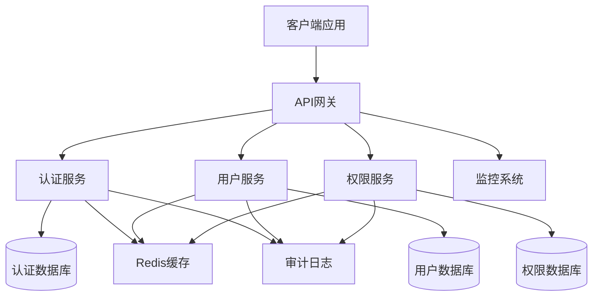

# 🔐 用户管理系统设计示例

> 使用 AxiomOS v17.2 设计一个完整的用户管理系统

## 📋 项目概述

**业务目标**: 构建一个安全、可扩展的用户管理系统  
**核心功能**: 用户注册、登录、权限管理、个人资料管理  
**技术要求**: 零信任安全、高可用性、可观测性

## 🎯 AxiomOS 工作流程演示

### 阶段1: Align (对齐) - 需求澄清

**用户输入**:
```
我需要设计一个用户管理系统，包括用户注册、登录和权限管理功能。
```

**AxiomOS 响应**:
```yaml
Self-Diagnostic Report:
  current_phase: "ALIGN"
  task_understanding: "用户管理系统架构设计"
  
澄清问题:
1. 预期用户规模是多少？(100, 10K, 100K, 1M+)
2. 是否需要支持第三方登录？(Google, GitHub, 企业SSO)
3. 权限管理的复杂度？(简单角色 vs 细粒度权限)
4. 合规要求？(GDPR, SOX, 等)
5. 技术栈偏好？(语言、数据库、部署环境)
```

### 阶段2: Architect (架构) - 系统设计

**基于澄清后的需求，AxiomOS 生成架构设计**:

#### 🏗️ 系统架构图


#### 🔒 安全架构设计
- **零信任原则**: 所有服务间通信使用mTLS
- **JWT令牌**: 短期访问令牌 + 长期刷新令牌
- **密码安全**: bcrypt + 盐值，密码策略强制执行
- **审计日志**: 所有关键操作记录，不可篡改

### 阶段3: Atomize (原子化) - 任务分解

**AxiomOS 生成的任务列表**:```yaml
任务分解:
  T1_数据模型设计:
    输入: 业务需求分析
    输出: 数据库Schema设计
    验收标准: 通过数据一致性检查
    
  T2_认证服务实现:
    输入: 数据模型 + 安全要求
    输出: JWT认证API + 单元测试
    验收标准: 安全测试通过，覆盖率>95%
    
  T3_用户服务实现:
    输入: 数据模型 + API规范
    输出: 用户CRUD API + 集成测试
    验收标准: API测试通过，性能达标
    
  T4_权限服务实现:
    输入: 权限模型设计
    输出: RBAC权限API + 权限测试
    验收标准: 权限逻辑正确，无越权漏洞
    
  T5_API网关配置:
    输入: 各服务API规范
    输出: 网关路由配置 + 限流策略
    验收标准: 路由正确，限流生效
    
  T6_监控告警配置:
    输入: 系统架构
    输出: 监控仪表板 + 告警规则
    验收标准: 关键指标可观测，告警及时
```

### 阶段4: Approve (批准) - 设计确认

**AxiomOS 请求确认**:
```
📋 设计方案总结:
- 微服务架构，3个核心服务
- 零信任安全模型
- Redis缓存提升性能
- 完整的监控和审计

✅ 请确认是否批准此设计方案？
   输入 "APPROVE" 继续实现
   输入 "MODIFY" 提出修改建议
```

### 阶段5: Act (执行) - 代码实现

**用户确认后，AxiomOS 开始生成代码**:

#### 🗄️ 数据模型示例 (TypeScript)
```typescript
// 用户实体
export interface User {
  id: string;
  email: string;
  passwordHash: string;
  profile: UserProfile;
  roles: Role[];
  createdAt: Date;
  updatedAt: Date;
  lastLoginAt?: Date;
  isActive: boolean;
}

// 权限模型
export interface Permission {
  id: string;
  resource: string;
  action: string;
  conditions?: Record<string, any>;
}

export interface Role {
  id: string;
  name: string;
  permissions: Permission[];
  description?: string;
}
```

#### 🔐 认证服务示例
```typescript
@Injectable()
export class AuthService {
  constructor(
    private userService: UserService,
    private jwtService: JwtService,
    private auditLogger: AuditLogger
  ) {}

  async login(credentials: LoginDto): Promise<AuthResult> {
    // 输入验证
    await this.validateCredentials(credentials);
    
    // 用户验证
    const user = await this.userService.validateUser(
      credentials.email, 
      credentials.password
    );
    
    if (!user) {
      await this.auditLogger.logFailedLogin(credentials.email);
      throw new UnauthorizedException('Invalid credentials');
    }

    // 生成令牌
    const tokens = await this.generateTokens(user);
    
    // 记录成功登录
    await this.auditLogger.logSuccessfulLogin(user.id);
    await this.userService.updateLastLogin(user.id);

    return {
      user: this.sanitizeUser(user),
      accessToken: tokens.accessToken,
      refreshToken: tokens.refreshToken
    };
  }

  private async generateTokens(user: User): Promise<Tokens> {
    const payload = { 
      sub: user.id, 
      email: user.email,
      roles: user.roles.map(r => r.name)
    };

    return {
      accessToken: await this.jwtService.signAsync(payload, {
        expiresIn: '15m'
      }),
      refreshToken: await this.jwtService.signAsync(payload, {
        expiresIn: '7d'
      })
    };
  }
}
```

### 阶段6: Assess (评估) - 质量检查

**AxiomOS 自动执行质量检查**:

```yaml
质量评估报告:
  代码质量:
    - ✅ TypeScript类型覆盖: 100%
    - ✅ 单元测试覆盖率: 97%
    - ✅ ESLint检查: 通过
    - ✅ 安全扫描: 无高危漏洞
    
  架构合规:
    - ✅ 零信任安全: 已实现mTLS
    - ✅ 可观测性: 已配置监控
    - ✅ 错误处理: 已实现优雅降级
    - ✅ 性能要求: 响应时间<100ms
    
  文档完整性:
    - ✅ API文档: OpenAPI 3.0
    - ✅ 部署文档: Docker + K8s
    - ✅ 运维手册: 监控和故障排除
```

## 🎯 学习要点

### 1. 领域驱动设计
- 用户、角色、权限作为核心领域概念
- 清晰的限界上下文划分
- 通用语言在代码中的体现

### 2. 零信任安全
- 默认拒绝，显式授权
- 服务间通信加密
- 完整的审计日志

### 3. 生产级标准
- 高测试覆盖率
- 完整的错误处理
- 可观测性设计
- 性能优化

## 🚀 下一步

1. **部署实践**: 使用提供的Docker配置部署到测试环境
2. **扩展功能**: 添加多因子认证、密码重置等功能
3. **性能优化**: 实施缓存策略、数据库优化
4. **安全加固**: 添加速率限制、异常检测

---

**示例复杂度**: 中级  
**预计开发时间**: 2-3周  
**适用场景**: 中小型企业用户管理系统